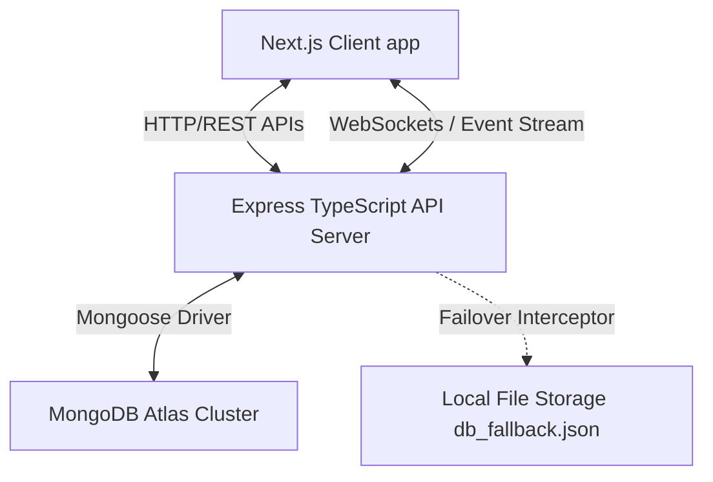

# Enterprise Infrastructure Management Platform (EIMP)

An enterprise-grade, portfolio-worthy IT Infrastructure and Security Management platform that simulates a real-world company's internal IT portal. EIMP is used daily by Firewall Engineers, Security Analysts, IT Admins, and Helpdesk Support Engineers to monitor telemetry, evaluate packet security, and manage users.

---

## 🏗️ Architectural Overview

EIMP is built on a decoupled, type-safe monorepo architecture leveraging:



* **Frontend**: Next.js (App Router), TypeScript, TailwindCSS, React Context APIs, Recharts data grids, Lucide visual tokens.
* **Backend**: Node.js, Express, TypeScript, Socket.IO, Helmet security middleware, Express Rate Limiter, and Mongoose ORM.
* **Database (Dual Persistence Mode)**:
  * **Primary**: MongoDB Atlas Cloud DB.
  * **Secondary (Automatic Failover)**: A custom-designed JSON filesystem persistence wrapper that intercepts database calls and falls back to local file storage if the MongoDB connection is offline.

---

## 📂 Project Directory Structure

```
Enterprise-IT-Management-Platform/
├── backend/
│   ├── src/
│   │   ├── config/             # Database connection & seed scripts
│   │   ├── controllers/        # Express request logic (Auth, Firewall, AD)
│   │   ├── middleware/         # Security headers, auth & error handlers
│   │   ├── models/             # Mongoose schemas & Proxy DB fallback wrappers
│   │   ├── routes/             # REST endpoint route bindings
│   │   ├── services/           # Live packet & metrics simulation engine
│   │   └── server.ts           # Socket.IO socket setup & express entry
│   ├── package.json
│   └── tsconfig.json
├── frontend/
│   ├── src/
│   │   ├── app/                # Next.js page modules (Dashboard, Firewall, AD)
│   │   ├── components/         # Reusable widgets & Navigation layouts
│   │   ├── context/            # React global states (AuthContext, SocketContext)
│   │   └── lib/                # API client connection drivers
│   ├── package.json
│   └── next.config.ts
└── .gitignore                  # Global git exclusions
```

---

## 🛠️ Feature Modules

### 1. Live Infrastructure Dashboard
* **Syslog Terminal Stream**: A live terminal emulation window showing incoming firewall logs and brute-force threat alerts via Socket.IO events.
* **Bandwidth Telemetry**: Dynamic area charts rendering real-time WAN, LAN, and DMZ bandwidth consumption.
* **Hardware Resource Gauges**: Radial monitors displaying simulated CPU/RAM metrics of key network servers (Domain Controllers, Mail Servers).

### 2. Firewall Manager & Simulator
* **Access Control Lists (ACL)**: Interactive rule builder to create, edit, delete, and prioritize policies.
* **Sequential Priority Matching**: Evaluation runs strictly based on the rule priority index.
* **Live Packet Simulator**: Input source IPs, destination IPs, and ports to evaluate matched rules against the simulation engine, outputting visual `Allow (FORWARD_ACCEPT)` or `Drop (Implicit Default Deny)` status cards.

### 3. Interactive Network Topology
* **SVG Network Mapping**: Interactive visual schematic of the enterprise subnet distribution (WAN, DMZ, Core Switches, LAN devices).
* **Remote Shell CLI**: Click on any active node to open an emulated Web SSH query terminal to run status queries (e.g. `ping`, `nslookup`, `systemctl status apache2`).

### 4. Active Directory (AD) Controller
* **Account Provisioning**: Manage corporate domain users.
* **Lockout Policy Admin**: Real-time audit of account statuses. Admins can lock/unlock accounts or execute remote password resets.

### 5. Helpdesk Support Ticketing
* **Escalation Management**: Raise Tier-1 tickets and escalate them to Tier-2 network specialists with a single click.
* **Collaborative Comment Trails**: Add notes and diagnostic logs directly into active ticket feeds.

### 6. Security Center & CVE Audit
* **Vulnerability Scanning**: Real-time CVE database dashboard showing severity levels (Low, Medium, High, Critical).
* **Failed Login Mitigations**: Dynamic controls to flag and mitigate brute-force attackers.

### 7. VPN Session Monitor
* **Active Connections Feed**: Monitor current VPN tunnels, client IP endpoints, and session throughput.
* **Administrator Kill-Switch**: Remote switch to terminate any active tunnel immediately.

---

## ⚙️ Environment Configurations

### Backend Setup (`backend/.env`)
Create a `.env` file in the `/backend` folder:
```env
PORT=5000
MONGODB_URI=mongodb+srv://<username>:<password>@<cluster>.mongodb.net/eimp?appName=Cluster0
JWT_SECRET=eimp_super_secure_access_token_secret_998877
JWT_REFRESH_SECRET=eimp_super_secure_refresh_token_secret_112233
NODE_ENV=development
```

### Frontend Setup (`frontend/.env`)
Create a `.env` file in the `/frontend` folder:
```env
NEXT_PUBLIC_API_URL=http://localhost:5000/api
NEXT_PUBLIC_CLERK_PUBLISHABLE_KEY=pk_test_...
CLERK_SECRET_KEY=sk_test_...
```

---

## 🚀 Setup & Installation

### Step 1: Install Dependencies
```bash
# Install backend dependencies
cd backend
npm install

# Install frontend dependencies
cd ../frontend
npm install
```

### Step 2: Seed the Database
Seed the base network nodes, corporate directories, default firewall rules, and tickets:
```bash
cd ../backend
npm run seed
```

### Step 3: Launch the Development Servers
Open two terminal windows:

* **Terminal 1 (Backend API)**:
  ```bash
  cd backend
  npm run dev
  ```
* **Terminal 2 (Frontend Client)**:
  ```bash
  cd frontend
  npm run dev
  ```

Open your browser to `http://localhost:3000` to start exploring the portal. Use the **Admin** preset on the login screen to auto-fill administrator credentials.
